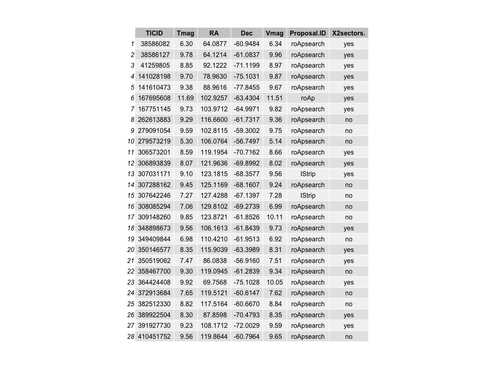
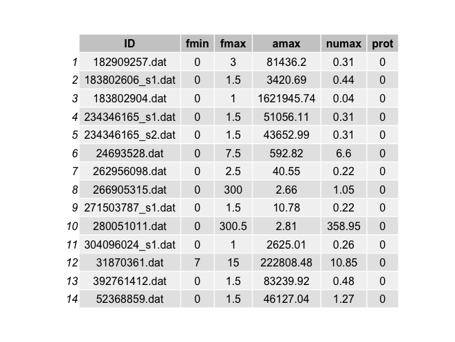
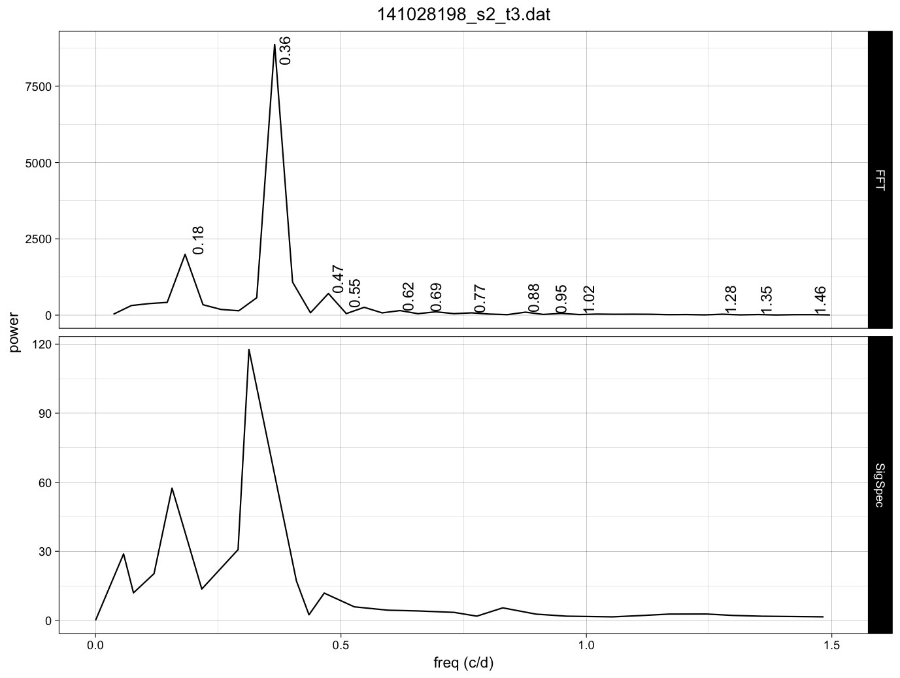
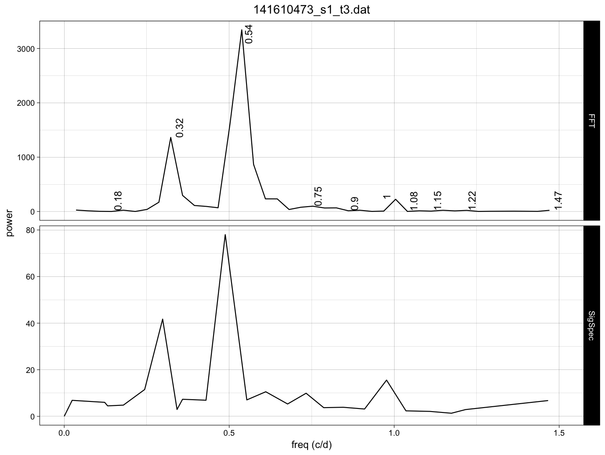
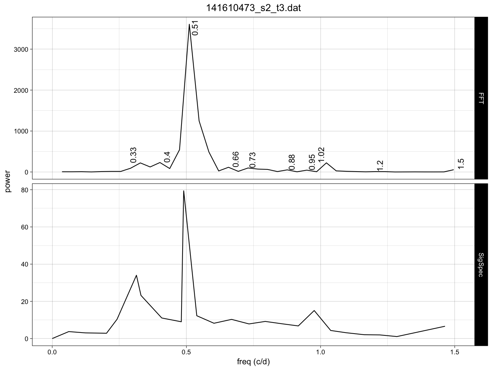
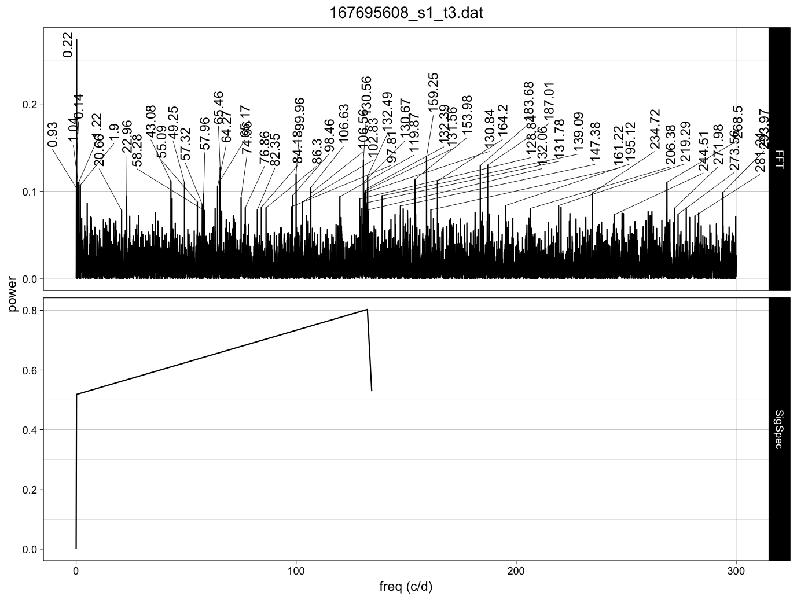
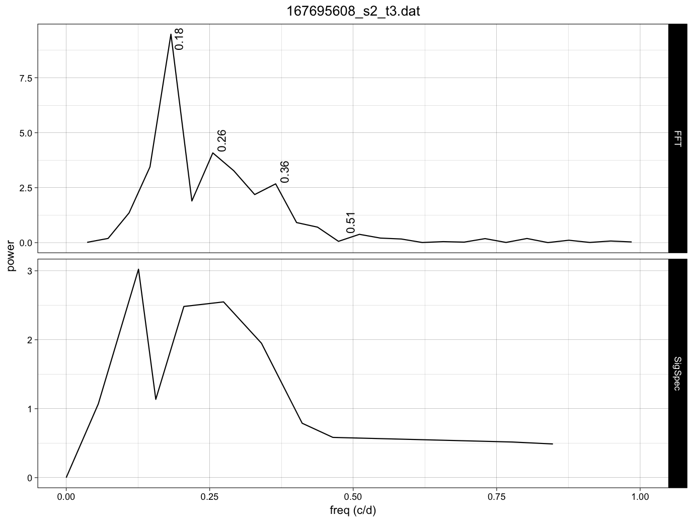

Frequency analysis on First Light TESS roAp stars (G4)
================
Granada PLATO Team
10/24/2018


## Abstract

This report contains the `FFT` (of the ARMA gap-filled TESS light curve) and 
powerspectra (from `SigSpec`).
For each star the comparison of both diagrams are displayed in a figure with 
two panels.

## The G4 data

The list of **G4** stars are provided in the <https://tasoc.dk/wg4/> website. 
The light curves were downloaded from MAST repository.


```{r g4 data}
pathdata <- "/Users/jcsuarez/Data/obs/TESS/Grupo4/"
filename <- paste(pathdata,"g4_tessFLstars.csv", sep = "")
data <- read.csv(file = filename, header = T, sep = ",", 
                             stringsAsFactors = FALSE)
```




## G4 output results

This table summarizes the results found for all the objects for which both FFT and SigSpec
data were available (two stars dropped out)



## FFT and PWT plots 

This section contains all the figures on which we based the results given in table above.

### 141028198_s2_t3



**Coments:** MIARMA LC ok, Prot 1/0.18 (sale doble), freq SigSpec

### 141610473_s1_t3



**Coments:** MIARMA LC ok(*), Prot 1/0.54 (sale doble), freq SigSpec

### 141610473_s2_t3



**Coments:** MIARMA LC ok, Prot 1/0.49 (sale doble), freq SigSpec

### 167695608_s1_t3



**Coments:** NO VALIDAMOS

### 167695608_s2_t3



**Coments:** MIARMA LC ok(*), Prot 1/0.205 (sale doble), freq SigSpec

