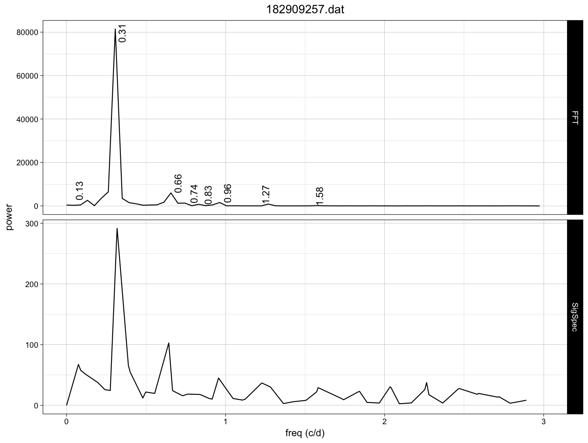
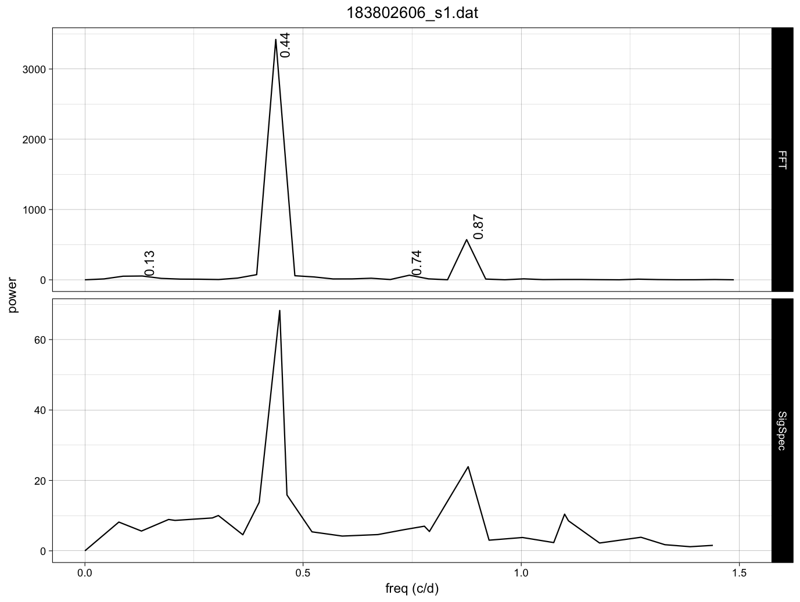
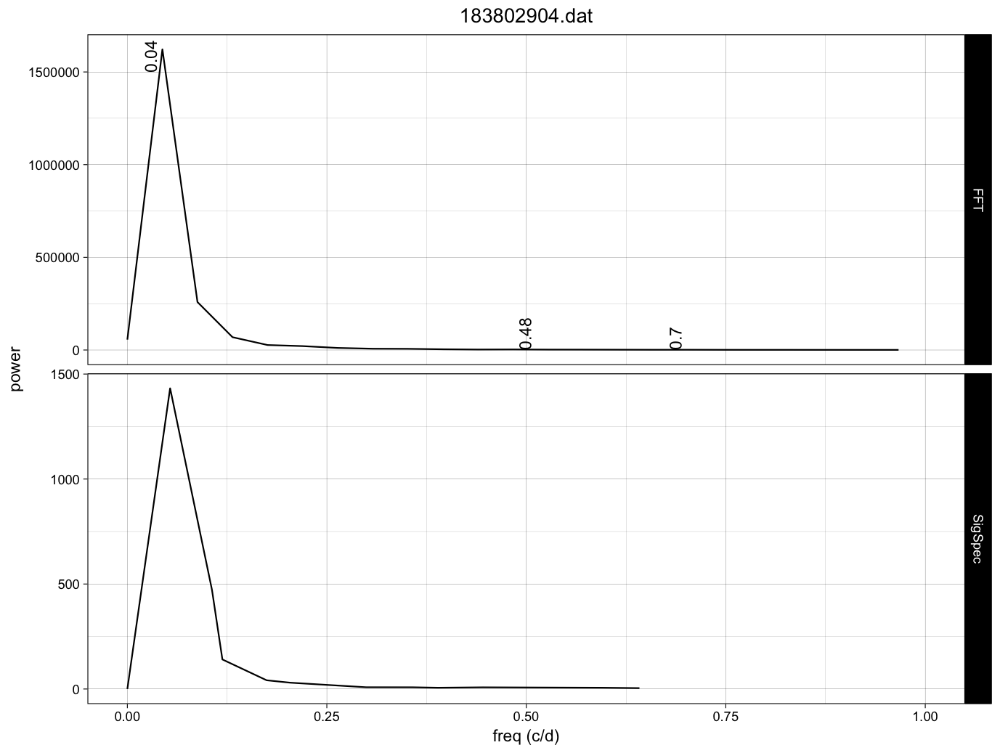
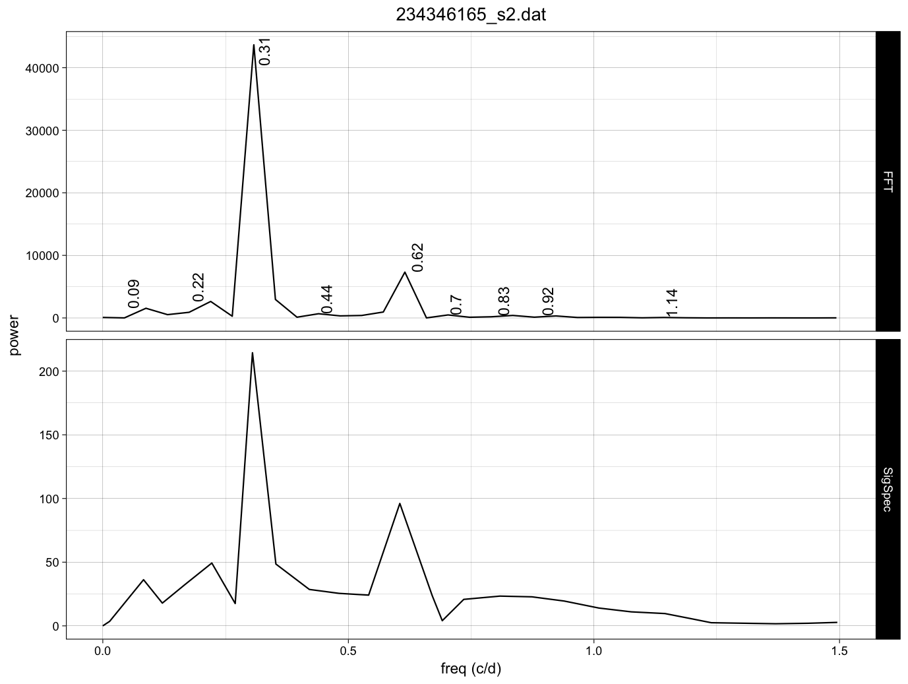
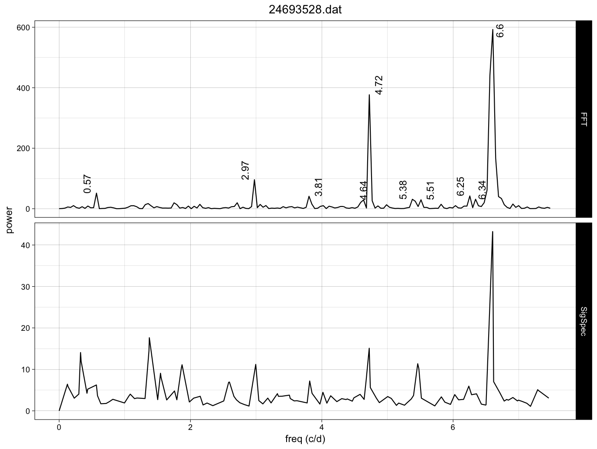
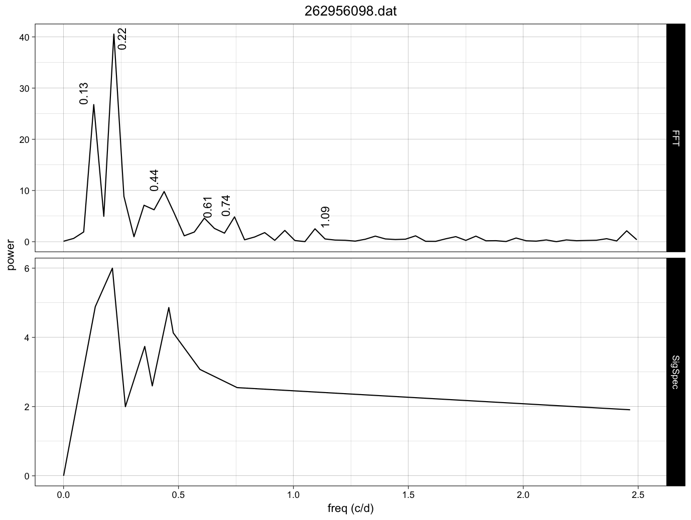
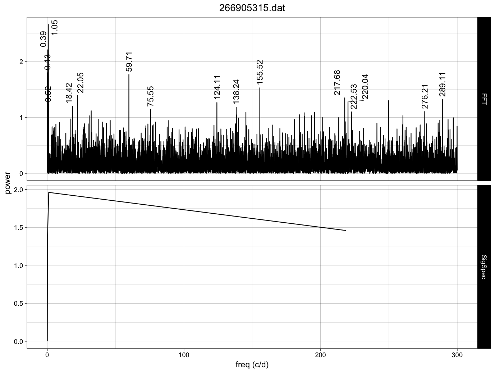
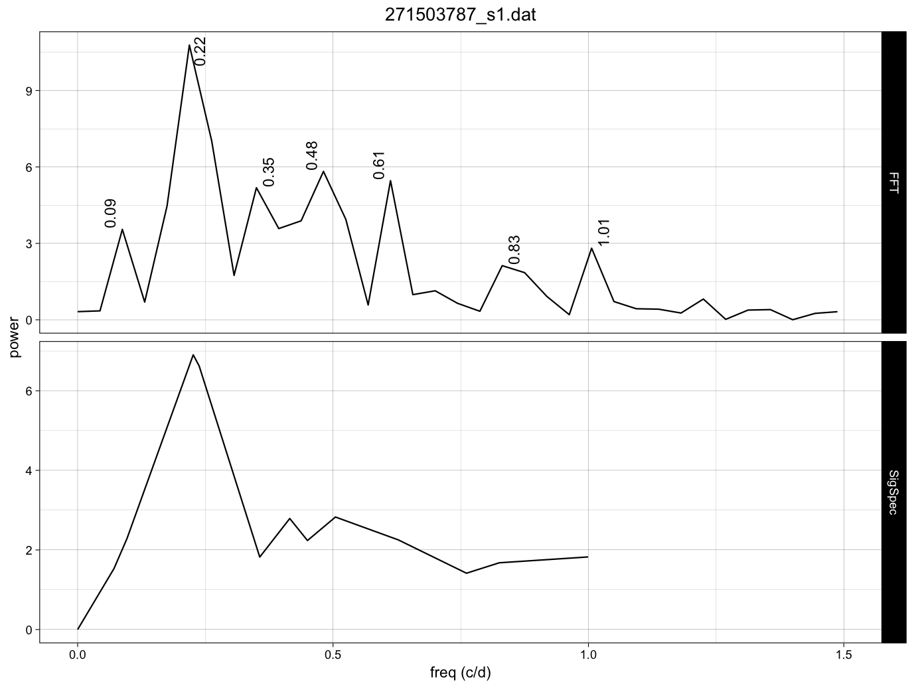
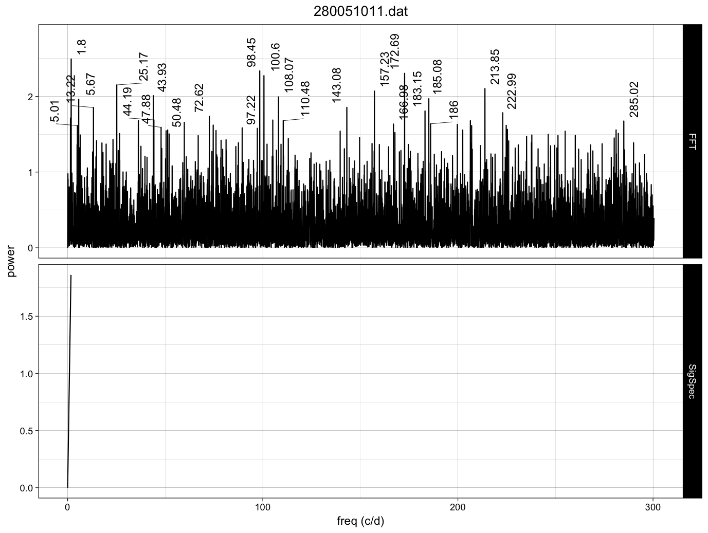
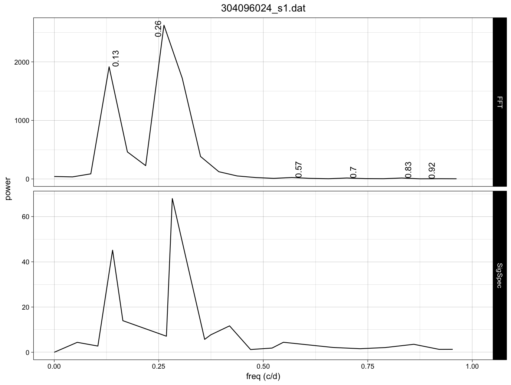

Frequency analysis on First Light TESS roAp stars 
================
Granada PLATO Team
10/24/2018


## Abstract

This report contains the `FFT` (of the ARMA gap-filled TESS light curve) and 
powerspectra (from `SigSpec`).
For each star the comparison of both diagrams are displayed in a figure with 
two panels.

## The G3 data

The list of **G3** stars are provided in the <https://tasoc.dk/wg4/> website. 
The light curves were downloaded from MAST repository.


```{r g3 data}
pathdata <- "/Users/jcsuarez/Data/obs/TESS/Grupo3/"
filename <- paste(pathdata,"g3_tessFLstars.csv", sep = "")
data <- read.csv(file = filename, header = T, sep = ",", 
                             stringsAsFactors = FALSE)
```


## G3 output results

This table summarizes the results found for all the objects for which both FFT and SigSpec
data were available (two stars dropped out)


## FFT and PWT plots 

This section contains all the figures on which we based the results given in table above.

### 182909257



**Coments:** Posible triplet? 

### 183802606_s1



**Coments:** mmm

### 183802904



**Coments:** mmm

### 234346165_s1


**Coments:** mmm

### 234346165_s2



**Coments:** mmm


### 24693528



**Coments:** mmm

### 262956098



**Coments:** mmm


### 266905315



**Coments:** mmm


### 271503787_s1



**Coments:** mmm


### 280051011



**Coments:** mmm

### 304096024_s1



**Coments:** mmm


