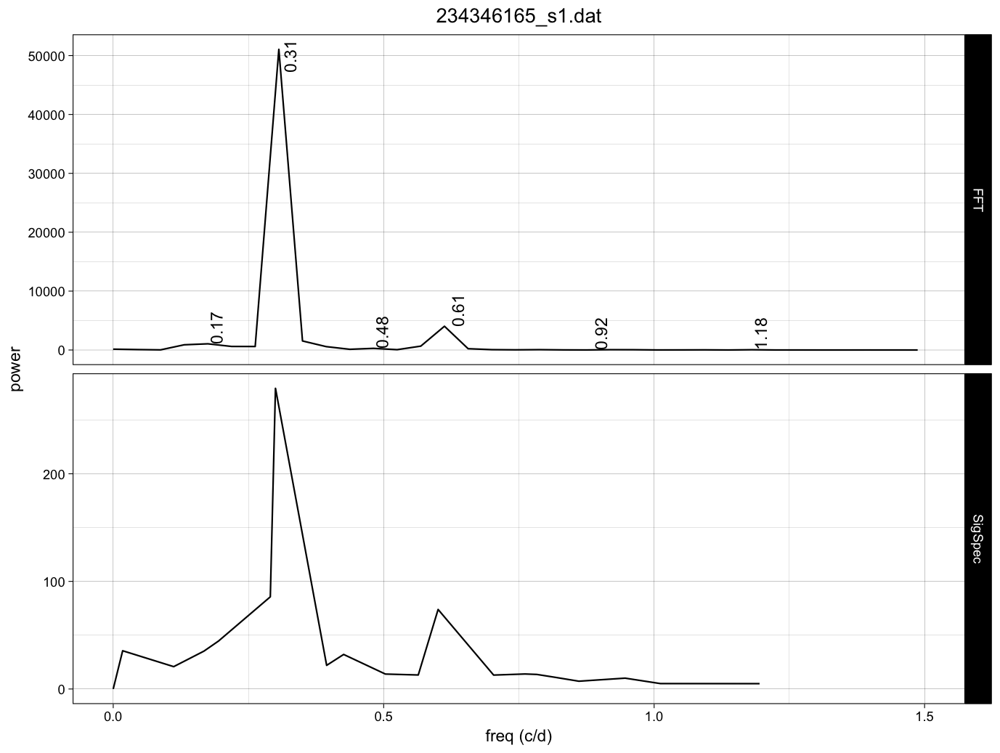
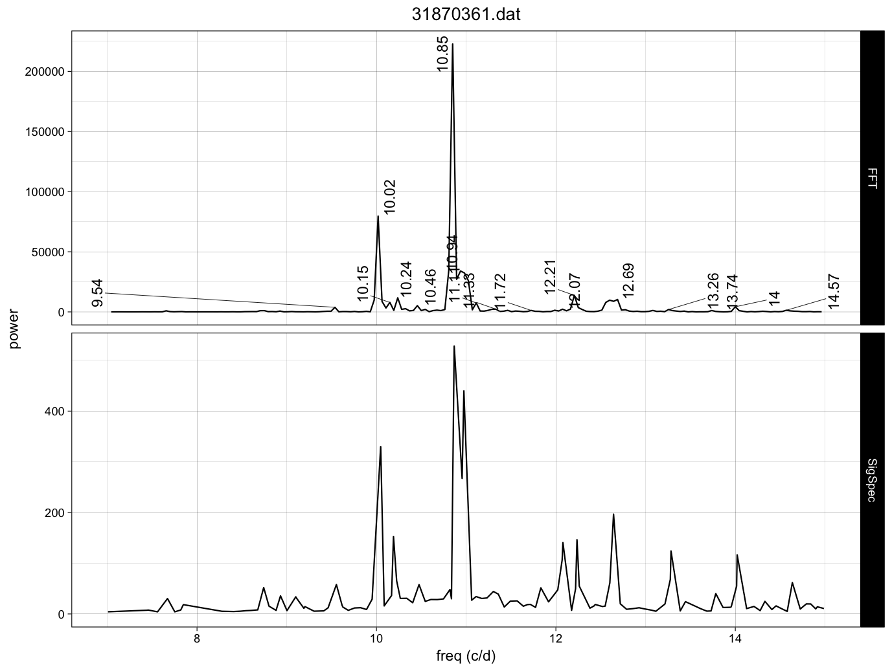
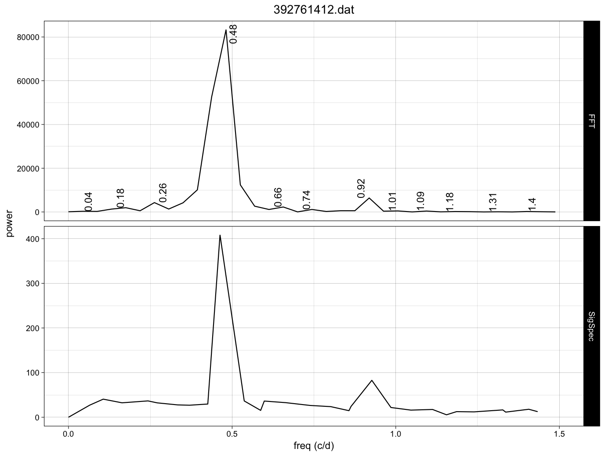
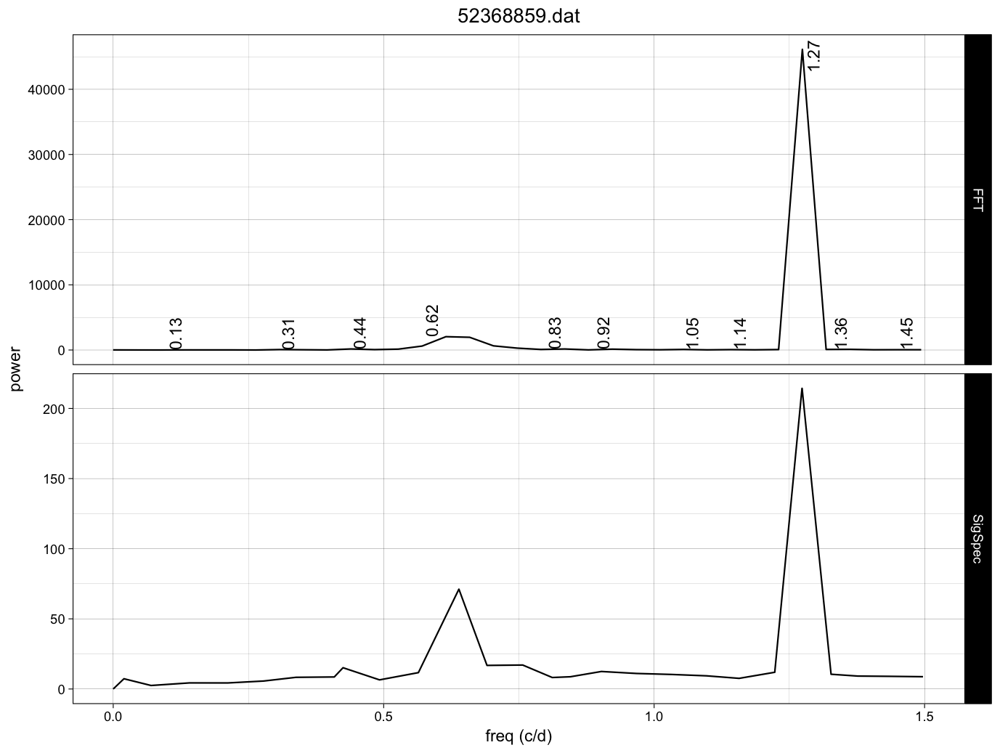

Frequency analysis on First Light TESS roAp stars 
================
Granada PLATO Team
10/24/2018


## Abstract

This report contains the `FFT` (of the ARMA gap-filled TESS light curve) and 
powerspectra (from `SigSpec`).
For each star the comparison of both diagrams are displayed in a figure with 
two panels.

## The G3 data

The list of **G3** stars are provided in the <https://tasoc.dk/wg4/> website. 
The light curves were downloaded from MAST repository.


```{r g3 data}
pathdata <- "/Users/jcsuarez/Data/obs/TESS/Grupo3/"
filename <- paste(pathdata,"g3_tessFLstars.csv", sep = "")
data <- read.csv(file = filename, header = T, sep = ",", 
                             stringsAsFactors = FALSE)
```


## G3 output results

This table summarizes the results found for all the objects for which both FFT and SigSpec
data were available (two stars dropped out)


## FFT and PWT plots 

This section contains all the figures on which we based the results given in table above.

### 182909257


**Coments:** MIARMA LC ok(*), Prot 1/0.31 (sale doble), freq SigSpec 

### 183802606_s1


**Coments:** MIARMA LC ok(*), Prot 1/0.44 (sale doble), freq SigSpec 

### 183802904


**Coments:** MIARMA LC ok, Prot 1/0.04 (no sale doble ya que nu_rot cercano a 0), freq SigSpec

### 234346165_s1



**Coments:** MIARMA LC Bad, Prot 1/0.31 (sale doble), freq SigSpec (WARNING por relleno)

### 234346165_s2


**Coments:** MIARMA LC Ok(*), Prot 1/0.31 (sale doble), freq SigSpec


### 24693528


**Coments:** MIARMA LC OK(*), No Prot, freq SigSpec (Clasific DScuti)

### 262956098


**Coments:** MIARMA LC Ok(*), Prot 1/0.22 (sale doble), freq SigSpec


### 266905315


**Coments:** NO VALIDAMOS


### 271503787_s1


**Coments:** MIARMA LC Ok(*), Prot 1/0.2 (sale doble aprox), freq SigSpec


### 280051011


**Coments:** NO VALIDAMOS

### 304096024_s1


**Coments:** MIARMA LC Ok, Prot 1/0.13 (sale doble), freq SigSpec

### 31870361



**Coments:** MIARMA LC OK(*), No Prot, freq SigSpec (Clasific DScuti)

### 392761412



**Coments:** MIARMA LC Ok(*), Prot 1/0.48 (sale doble), freq SigSpec

### 52368859



**Coments:** MIARMA LC Ok(*), Prot 1/0.62 (sale doble), freq SigSpec


